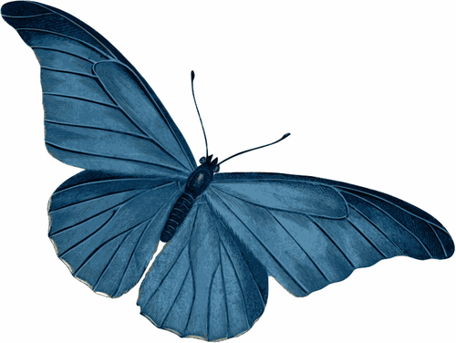

<p align="center">
    
</p>

# Butterfly
Butterfly is a lightweight approach to embed websites Qualtrics surveys and observe user behavior. It can be used to track user behavior on single websites or in online experiments (e.g. in controlled usability experiments). 

Qualtrics is used to conveniently manage the overall study flow including consent, random assignment of participants to treatments, manipulation checks, etc. The stimulus website is embedded into Qualtrics via an iframe. Currently, Butterfly can track only user clicks on a stimulus website. Clicks are then stored in a Qualtrics question and can be easily analyzed afterwards. It is therefore not required to manually match a users's survey inputs with other behavioral data (e.g., server logs, analytics tools) after the survey.

A demo of Butterfly is available [here.](https://immzhaw.eu.qualtrics.com/jfe/form/SV_887kj9vYpIqnBfU) 

Please cite as:

Ebert, N., Scheppler, B. 2021. Butterfly: a lightweight approach for webtracking with Qualtrics, doi:10.5281/zenodo.5211214

## Quick start

### Import butterfly_template.qsf

Start by [importing](https://www.qualtrics.com/support/survey-platform/survey-module/survey-tools/import-and-export-surveys/) butterfly_template.qsf in Qualtrics. 

Your website https://www.mywebsite.com/index.html will be display as an iframe within Qualtrics. Therefore, switch to [survey flow](https://www.qualtrics.com/support/survey-platform/survey-module/survey-flow/survey-flow-overview/) and update the following variables:
- iframe_url (url of your website, e.g.; https://www.mywebsite.com/index.html)
- iframe_border (border size of iframe)
- iframe_height (height of iframe)
- iframe_width (width if iframe)
- iframe_scroll (scrollbars yes or no)

Afterwards, go to the question named website and click on its [JavaScript](https://www.qualtrics.com/support/survey-platform/survey-module/question-options/add-javascript/).

Replace the following line of code... 
```javascript
   if (event.origin != "https://nebert.github.io") {
```
with

```javascript
   if (event.origin != "https://www.mywebsite.com") {
```

Finally hide the question which collects the user data in Qualtrics via design -> style -> [custom css](https://www.qualtrics.com/support/survey-platform/survey-module/look-feel/fonts-and-colors/#AddCustomCSS)

Add the following CSS:

```css
div#QID199 {
    visibility: hidden;
    display:none;
}
```

### Embed Butterfly in Website

First, deploy your webpage and embed butterfly. For an example see butterfly_example.html in the example folder.

Add JQuery and butterfly_qualtrics.js to each html page. butterfly_qualtrics.js must be added right before the closing body tag. Afterwards add the class "reactOnClick" to the objects you want to track and give them unique id. The following code will react on a click to the button with the id MyButton. 

```html
<head>
 <title>demo</title>
     <script src="https://ajax.googleapis.com/ajax/libs/jquery/3.6.0/jquery.min.js"></script>    
</head>
<body>
    <a><div id="MyButton" class="reactOnClick">MyButton</div></a>
    <script type="text/javascript" src="butterfly_qualtrics.js"></script>  
</body>
```

### Next Button

When your website is presented via Qualtrics the next button of your survey is hidden by default. If you want to always display the next button, remove the following line of code from the JavaScript of the "Website" question in Qualtrics.

```javascript
this.hideNextButton();
```

Two display the next button after it was hidden you have two options.

By default the next button is displayed automatically after 30 seconds. Remove the following line if you want to manually active the next button or change the value 30000ms by any other meaningful duration.

```javascript
setTimeout(function() { jQuery("#NextButton").show(); },30000);
```

You can also active the next button via a specific user click on your website.

Simply add the class "enableNextButton" behind "reactOnClick" in your html code.

```html
<a><div id="MyButton" class="reactOnClick enableNextButton">MyButton</div></a>
```
